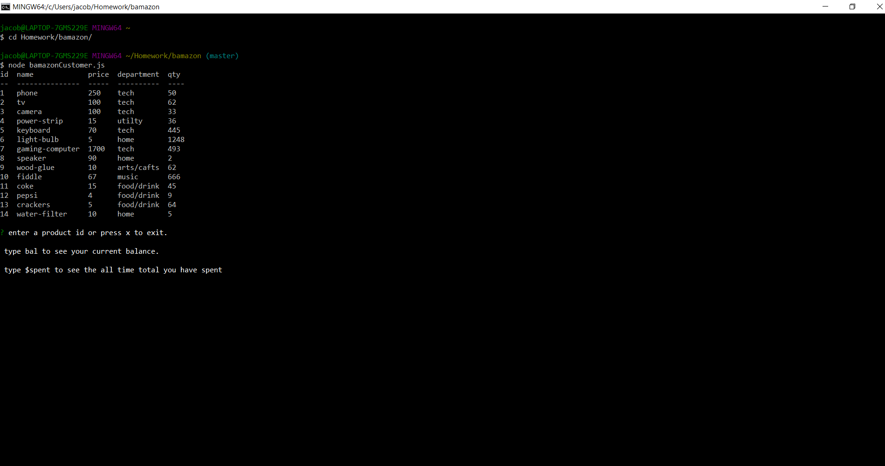
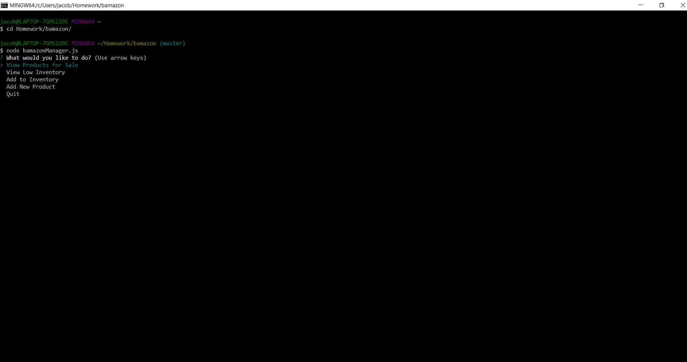
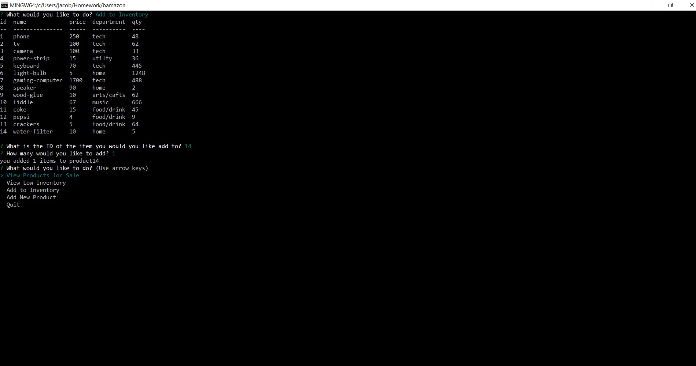

# bamazon
# created by Tacob Tate for homework

Bamazon is like a node cli version of Amazon. 
To install: 
clone (ssh):<code>git@github.com:JacobTate/bamazon.git</code> 
clone (https): <code>https://github.com/JacobTate/bamazon.git</code> 
Git bash command: <code> git clone [url]</code> 
There are two views. customer view and manager view. 
To see the customer view use <code> node bamazonCostomer.js</code> 
For manager view use <code> node bamazonManager.js</code> 
When You open the customer view you will see a table of all of the products for sale. there are 4 operations You can perform.

- x 
- bal 
- $spent 
- product id
  
press x to quit. 
bal will whow You how much money You have 

$spent will show You the all time total ammount You have spent. 

On the left side of the table You will see the names of the products and their id's.
To purchace a item enter Its id and You will be promped for the quanity You would like to purchase.

After You enter the quanity it will make sure there is enough in stock

 and that You have enough money.
 
When You open the manager view you will see several options.

 

- View Products for Sale 
- View Low Inventory 
- Add to Inventory 
- Add New Product 
- Quit 
View products for sale will whow You the table of all the products currently for sale. 

View low inventory will show You a table of all the products for sale with less than 10 left. 

Add to inventory show the product table and ask you to input the id of the product you would like to add to. Then you will be asked how many You would like to add. 

Add new product will ask you sevaral questions about the product you would like to add. You will be asked for the product id, the name,
the department, the price and the quanity. See the <a href="https://www.youtube.com/watch?v=u-zbZPuzvWE&feature=youtu.be" target="_blank">Video</a> 
Things to see:

- Costomer view <a href="https://www.youtube.com/watch?v=wlKy8HSuXoI&feature=youtu.be" target="_blank">Video</a> 
- Manager view <a href="https://www.youtube.com/watch?v=zWSGd41u-cg&feature=youtu.be" target="_blank">Video</a> 
- Add a product <a href="https://www.youtube.com/watch?v=u-zbZPuzvWE&feature=youtu.be" target="_blank">Video</a>
- Database setup <a href="https://youtu.be/S_uShaCs8r4" target="_blank">video</a>
